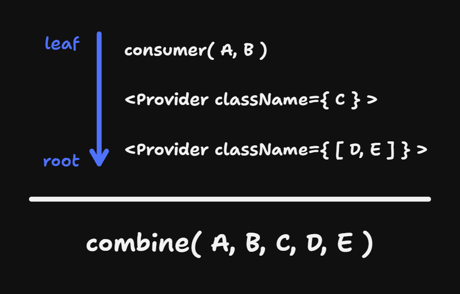

# use-cascade

  [](https://codecov.io/gh/adrgautier/cascade)  [](https://www.npmjs.com/package/use-cascade)


Passing style through the context instead of props.

## Motivation

To be completed.

## Quick example

First, create a new *Cascade*. 

```ts
import { createCascade } from 'use-cascade';

const cc = createCascade();
```

As its core, a *Cascade* is a function that **combines** the classnames passed as **direct arguments** with the classnames provided **in the context(s)**.

The direct arguments can be used to give the "base" style to your element:

```tsx
export function TextInput() {
    return <input type="text" className={cc('input')} />
}
```

The *Cascade* gives you access to a *Provider* component with the `Provider` property.

> ### 💡 Idea
> You can expose the *Provider* along-side the actual component like so:
>```ts
>TextInput.Cascade = cc.Provider;
>```

On a parent component, you can provide new classnames to the cascade like so:

```tsx
function Form() {
    return (<TextInput.Cascade className="formInput">
        <TextInput />
    </TextInput.Cascade>);
}
```

In this example, the input element will receive both `'input'` and `'formInput'` classnames.


## Core concepts

### The *combine* function

As introduced above, the main feature of the *Cascade* is to *combine* multiple classnames (from direct parameters and the context).

The default *combine* function only accepts an **array of strings**. Its only feature is to join them using a space:

```ts
function combine(...args: string[]): string {
	return args.join(" ");
}
```

The output of the *combine* function is what is returned by the *consumer* function (i.e. `cc()`).

You can provide a custom *combine* function when creating the *Cascade*:

```ts
const cc = createCascade(customCombineFunction);
```

The custom *combine* function must at least accepts (one or more) string parameters. The *consumer* function and *Provider* component **infers** the accepted values from the custom combine function provided.

### The *Cascade* direction

The *Cascade* analogy can be a misleading at first.



The *consumer* function (i.e. `cc()`) is where the *Cascade* starts. As we go up the React tree (to the root) each *Provider* **inherits** the parameters provided to the *Cascade*.

Once the end of the *Cascade* is reached, the **inheritance** of the last *Provider* (the highest in the React tree) is sent to the *combine* function.

> Note: **inheriting** does not necessarily mean keeping all the parameters provided to the Cascade.
> The *Provider* can receive a function that allows you to ignore some parameters as we go down the Cascade.

### The *Provider* component

The Provider allows to handle the parameters in the *Cascade* in serveral ways.

#### Simple `string`

As seen in the quick example we can pass a `string` value to the className prop:

```tsx
<TextInput.Cascade className="formInput">
    {/*...*/}
</TextInput.Cascade>
```

The string is **added** to the *Cascade* (at the end of the inherited parameters array).

#### **Array** of parameters

You can also pass an array of parameters. The accepted values are infered from the accepted values of the *combine* function.

```tsx
<TextInput.Cascade className={['italic', 'bold']}>
    {/*...*/}
</TextInput.Cascade>
```

The new parameters are **added** to the *Cascade* (at the end of the inherited parameters array).

#### **Record**

Passing a *Record* allows to add parameters to the *Cascade* conditionally. The keys *Record* are the targets (only strings are allowed). The values are either a simple `string` or an *array* of parameters. 

```tsx
<TextInput.Cascade className={{ 'target1': ['italic', 'bold', 'target2': 'exposant']}}>
    {/*...*/}
</TextInput.Cascade>
```

If the target is found in the inherited parameters, the new parameter(s) are **added** to the *Cascade* (at the end of the inherited parameters array).

> Note: The exact string is expected in the inherited parameters.

#### **Function**

If all the above options are not enough, you can get the full control over the Cascade by providing a function.

```tsx
<TextInput.Cascade className={(inheritedParameters) => ['ignore', 'inherited', 'parameters']}>
    {/*...*/}
</TextInput.Cascade>
```

This function receives the inherited parameters as an argument. You are free to return only new paramters as long as they are compatible with the combine function.

## Use cases

#### Using `classnames`

You can provide the `classnames` helper as the first argument of `createCascade` when creating a new *Cascade*:

```ts
import classNames from 'classnames';

const cc = createCascade(classNames);
```

The resulting `cc` function accepts the same arguments as the provided helper:

```tsx
export function TextInput({ focused, value }: TextInputProps) {
    return <input type="text" className={cc('input', { focused, empty: !value })} />
}
```

The *Provider* component accepts values compatible with *classNames*: 
```tsx
<TextInput.Cascade className={[{ highlight: true }]}>
    <TextInput />
</TextInput.Cascade>
```

#### Using `classnames` for CSS modules

If you use CSS modules, you may want to use the "bind" approach from `classnames`:

```ts
import classNames from 'classnames/bind';

const cx = classNames.bind(styles);
```

Because of typings constraints you must use the bind helper provided by `use-cascade`:

```ts
import classNames from 'classnames/bind';
import { createCascade, bind } from 'use-cascade';

const cc = createCascade(bind(classNames, styles));
```

#### `tailwind-merge` for better tailwind DX

If you use tailwind, you may want to deduplicate classes and override already defined rules. `tailwind-merge` is the tool for you:

```ts
twMerge('px-2 py-1 bg-red hover:bg-dark-red', 'p-3 bg-[#B91C1C]')
// → 'hover:bg-dark-red p-3 bg-[#B91C1C]'
```

As usual, you can create a Cascade with that custom combine function:

```ts
const cc = createCascade(twMerge);
```

Using the same values as the above example:

```tsx
// TextInput component
<input type="text" className={cc('px-2 py-1 bg-red hover:bg-dark-red')} />

// parent component
<TextInput.Cascade className="p-3 bg-[#B91C1C]">
    {/* ... */}
</TextInput.Cascade>
```

Under the hood, the `twMerge` helper will produce the expected class combination.
